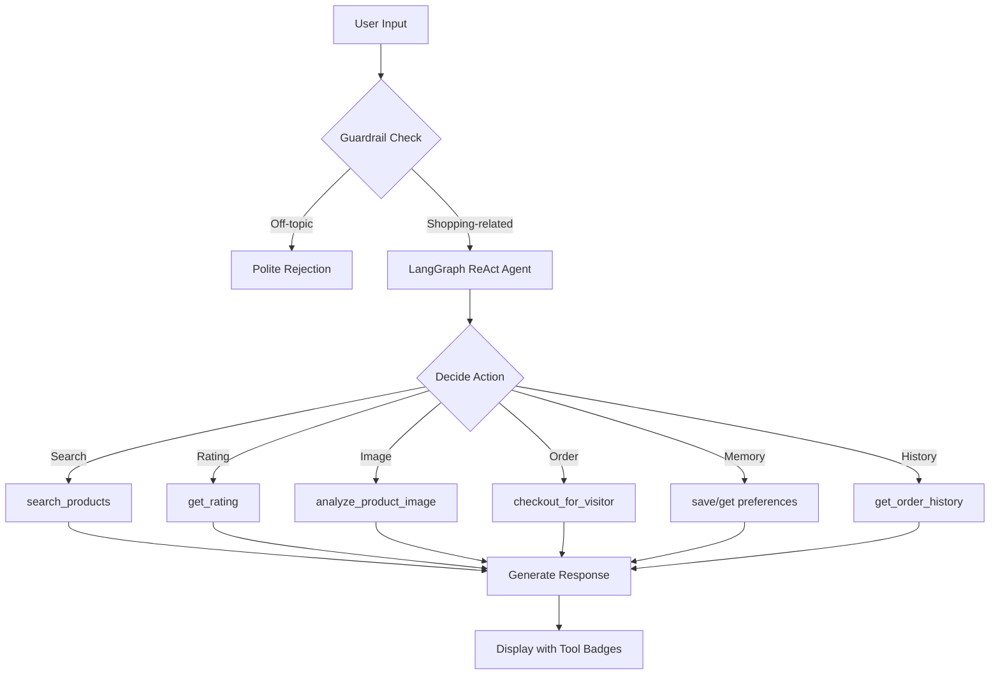

<div align="center">

# 🛒 ShopSmart AI — Intelligent Shopping Agent

**An AI-powered shopping assistant built with LangChain, LangGraph, and Groq**

*Search products, compare ratings, get personalized recommendations, and place orders — all through natural conversation.*

[](https://streamlit.io)
[](https://langchain.com)
[](https://groq.com)
[](https://python.org)

</div>

---

## ✨ Features

| Feature | Description |
|---------|-------------|
| 🔍 **Smart Product Search** | Natural language queries with price & organic filters |
| ⭐ **Ratings & Reviews** | Auto-fetches average ratings for every product shown |
| 📷 **Image Search** | Upload a product photo → vision LLM identifies it → searches catalog |
| 🛒 **Conversational Checkout** | Browse → select → confirm → order, all in chat |
| 💾 **Memory & Preferences** | Remembers your preferences across the session |
| 📦 **Order History** | View your past purchases anytime |
| 🛡️ **Input Guardrail** | Blocks off-topic queries before they reach the agent |
| 📊 **Evaluation Suite** | Tool call accuracy + LLM-as-judge response quality evals |

---

## 🏗️ Architecture

```
┌─────────────────────────────────────────────────────────────────┐
│                        Streamlit UI (app.py)                    │
│  ┌──────────┐  ┌──────────────┐  ┌───────────┐  ┌───────────┐   │
│  │ Chat UI  │  │ Image Upload │  │ Sidebar   │  │ Tool      │  │
│  │          │  │              │  │ (stats,   │  │ Badges    │  │
│  │          │  │              │  │  prompts) │  │           │  │
│  └────┬─────┘  └──────┬───────┘  └───────────┘  └───────────┘  │
│       │               │                                        │
│       ▼               ▼                                        │
│  ┌─────────────────────────────┐                               │
│  │   🛡️ Input Guardrail       │ ← Llama 3.1 8B (fast check)    │
│  │   (is_shopping_request)     │                                │
│  └─────────────┬───────────────┘                                │
│                │ ✅ On-topic                                   │
│                ▼                                                │
│  ┌─────────────────────────────┐                                │
│  │   🤖 Shopping Agent        │ ← Qwen3 32B (main reasoning)    │
│  │   (LangGraph ReAct Agent)  │                                 │
│  └─────────────┬───────────────┘                                │
└────────────────│────────────────────────────────────────────────┘
                 │
                 ▼
┌─────────────── Tools ──────────────────┐
│                                        │
│  🔍 search_products    ⭐ get_rating   │
│  📷 analyze_image      🛒 checkout     │──→  SQLite DB (store.db)
│  💾 save_preference    📋 get_prefs    │     • 32 products
│  📦 get_order_history                  │     • 102 reviews
│                                        │     • orders & preferences
└────────────────────────────────────────┘
```

### Tech Stack

| Layer | Technology | Purpose |
|-------|-----------|---------|
| **LLM (Agent)** | Qwen3-32B via Groq | Main reasoning & tool-calling |
| **LLM (Vision)** | Llama 4 Scout via Groq | Product image analysis |
| **LLM (Guardrail)** | Llama 3.1-8B via Groq | Fast input classification |
| **Agent Framework** | LangGraph + LangChain | ReAct agent with memory |
| **Database** | SQLite | Products, reviews, orders, preferences |
| **UI** | Streamlit | Dark-themed chat interface |

---

## 📸 Demo

### Chat Interface
The premium dark-themed UI with glassmorphism chat bubbles, tool usage badges, and sidebar with quick-action prompts.

### Conversation Flow
```
You:        "Show me organic honey under $20"
Agent:      🔍 Product Search  ⭐ Rating Lookup

            #1. Organic Raw Honey (ID:1) - $14.99 - rating 4.62 - organic
            #2. Organic Buckwheat Honey (ID:5) - $18.99 - rating 4.62 - organic
            #3. Organic Acacia Honey (ID:7) - $17.99 - rating 4.75 - organic

            Would you like to order one of these?

You:        "yes, #3"
Agent:      🛒 Checkout
            Order #7 confirmed! 'Organic Acacia Honey' for $17.99

You:        "what's the weather?"
Agent:      🛡️ Off-topic detected
            I'm a shopping assistant 🛒 — I can help you with searching
            for products, checking ratings, placing orders...
```

---

## 🚀 Getting Started

### Prerequisites
- Python 3.11+
- Free [Groq API key](https://console.groq.com/keys)

### Installation

```bash
# 1. Clone the repo
git clone https://github.com/Akash-8004/ai-shopping-agent.git
cd ai-shopping-agent

# 2. Install dependencies
pip install -r requirements.txt

# 3. Set up your API key
cp .env.example .env
# Edit .env and paste your GROQ_API_KEY

# 4. Run the app
streamlit run app.py
```

The app opens at **http://localhost:8501** 🎉

### CLI Mode (no UI)

```bash
python shopping_agent.py
```

---

## 📁 Project Structure

```
shopping-agent/
├── app.py                  # Streamlit UI (dark theme, chat, guardrail)
├── shopping_agent.py       # Agent creation + input guardrail
├── tools.py                # 7 agent tools (search, checkout, prefs, etc.)
├── llms.py                 # LLM configuration (3 models via Groq)
├── review_api.py           # Product rating aggregation
├── store.db                # SQLite database (32 products, 102 reviews)
├── requirements.txt        # Python dependencies
├── .env.example            # API key template
├── .gitignore
├── .streamlit/
│   └── config.toml         # Streamlit dark theme config
└── evals/
    ├── tool_call_eval.py       # Tool call accuracy evaluation
    └── response_quality_eval.py # LLM-as-judge quality evaluation
```

---

## 🛡️ Guardrail

An **input guardrail** runs before every user message reaches the agent. It uses a fast, lightweight LLM (Llama 3.1-8B) to classify whether the input is shopping-related:

```python
# shopping_agent.py
def is_shopping_request(user_input: str):
    # Uses Llama 3.1-8B for fast YES/NO classification
    # ✅ YES → product search, orders, recommendations, cart
    # ❌ NO  → weather, coding, jokes, general knowledge
```

- **Fail-open**: if the guardrail errors, the request passes through to the agent
- **Token-efficient**: blocks off-topic queries before the expensive agent call

---

## 📊 Evaluation Results

### 1. Tool Call Accuracy — **6/6 (100%)**

Tests whether the agent calls the **right tool** with the **right parameters**.

```
[1/6] organic honey under $20 → search_products(is_organic=True, max_price≤20)    ✅ PASS
[2/6] show me olive oil → search_products(query has 'olive' or 'oil')              ✅ PASS
[3/6] remember I prefer organic → save_preference_for_visitor                      ✅ PASS
[4/6] what have I ordered? → get_order_history_for_visitor                         ✅ PASS
[5/6] show me coffee → search_products(query has 'coffee')                         ✅ PASS
[6/6] what are my preferences? → get_preferences_for_visitor                       ✅ PASS

Result: 6/6 passed
```

### 2. Response Quality (LLM-as-Judge) — **4.9/5.0**

An LLM judge scores each response on Relevance, Correctness, and Format Compliance.

| Test Case | Relevance | Correctness | Format | Avg |
|-----------|:---------:|:-----------:|:------:|:---:|
| Organic honey under $20 | 5/5 | 5/5 | 5/5 | **5.0** |
| Olive oil listing | 5/5 | 5/5 | 5/5 | **5.0** |
| Cheapest grains | 5/5 | 4/5 | 5/5 | **4.7** |
| Tea options | 5/5 | 4/5 | 5/5 | **4.7** |
| Organic snacks | 5/5 | 5/5 | 5/5 | **5.0** |
| Coffee products | 5/5 | 5/5 | 5/5 | **5.0** |
| **Average** | **5.0** | **4.7** | **5.0** | **4.9** |

### Run Evals Yourself

```bash
# Tool call accuracy
python evals/tool_call_eval.py

# Response quality (LLM-as-judge)
python evals/response_quality_eval.py
```

---

## 🧠 How It Works

### Agent Flow



### Tool Details

| Tool | Trigger | What It Does |
|------|---------|-------------|
| `search_products` | "show me...", "find..." | SQL LIKE query with price/organic filters |
| `get_rating` | After search results | Fetches AVG rating from reviews table |
| `analyze_product_image` | Image uploaded | Vision LLM → identify → search |
| `checkout_for_visitor` | "yes", "order #2" | INSERT into orders table |
| `save_preference_for_visitor` | "I prefer...", "remember..." | UPSERT into preferences table |
| `get_preferences_for_visitor` | Before personalized search | SELECT from preferences |
| `get_order_history_for_visitor` | "my past orders" | SELECT recent 20 orders |

---

## 🗄️ Database Schema

```sql
products (32 rows)     — id, name, category, price, description, is_organic
reviews  (102 rows)    — id, product_id, rating, reviewer_name, review_text
orders                 — id, visitor_id, product_id, product_name, price, ordered_at
preferences            — id, visitor_id, preference_key, preference_value, updated_at
```

**Categories**: honey, oil, nuts, seeds, grains, tea, coffee, snacks, dairy-alt

---

## 📄 License

This project is open source and available under the [MIT License](LICENSE).

---

<div align="center">

**Built with ❤️ using LangChain, LangGraph, Groq & Streamlit**

</div>
